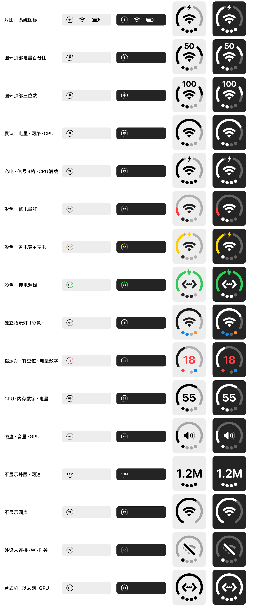
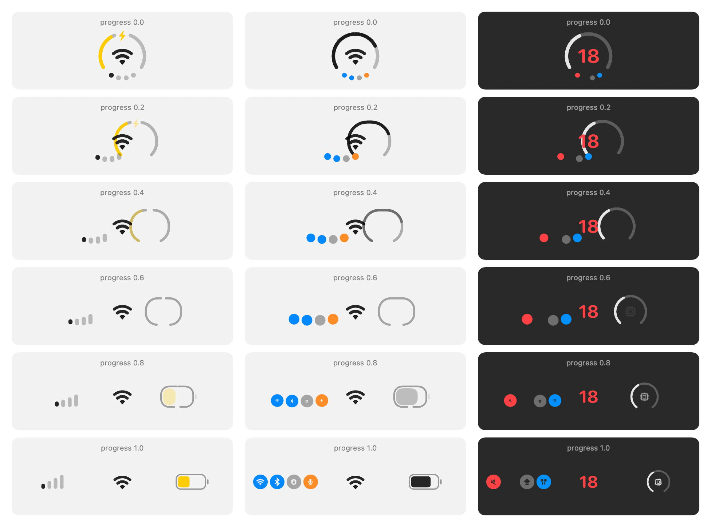

# DuoBar

把 iPhone Duo 外屏上的“三合一”状态图标搬到 Mac 菜单栏：一个圆形图标同时显示三种状态，显示什么由你决定。



> DuoBar 是独立的非官方项目，与 Apple Inc. 没有关联。

## 下载和安装

从 [GitHub Releases](https://github.com/Mujh05/DuoBar/releases/latest) 下载 `DuoBar-1.0-arm64.dmg`。当前版本需要 macOS 14 或更高版本，仅支持 Apple Silicon（M1 及后续芯片）。

1. 打开 DMG，把 DuoBar 拖到 Applications。
2. 第一次启动时，在“应用程序”中右键 DuoBar，选择“打开”，再确认打开。
3. 如果仍被拦截，前往“系统设置 › 隐私与安全性”，找到 DuoBar 的提示并点“仍要打开”。

当前安装包使用 ad-hoc 签名，尚未经过 Apple 公证，因此直接双击时可能被 Gatekeeper 拦截。这不代表 DMG 已损坏；后续版本会在具备 Developer ID 签名和公证条件后改善安装体验。

## 三个位置

| 位置 | 怎么显示 |
| --- | --- |
| 外圈圆环 | 按比例填满圆环，从左下角顺时针增长。放电量时，充电显示闪电，接着电源但没在充电显示插头 |
| 中间 | 网络显示 Wi-Fi / 以太网 / 热点图形，音量显示喇叭，其他状态显示数字 |
| 底部圆点 | 两种用法：显示某个状态的档位（≥5%、≥30%、≥55%、≥80% 依次点亮），或切到“独立指示灯”，4 个点各自显示一项开关 |

默认是“外圈电量、中间网络、底部 CPU”。每个位置都可以换成下面任意一种，也可以设成不显示（至少留一个位置）。外圈不显示时，中间的内容会放大；底部不显示时，圆环开口会收小。

## 可显示的状态

| 状态 | 说明 | 更新 |
| --- | --- | --- |
| 电量 | 内置电池剩余电量；台式机显示为接着电源 | 系统通知 |
| 网络 | 连接方式（Wi-Fi、以太网、个人热点）；数值是 Wi-Fi 信号强度，有线算满格 | 系统通知 + 8 秒 |
| CPU 占用 | 所有核心的平均占用率 | 2 秒 |
| GPU 占用 | 图形处理器占用率 | 2 秒 |
| 内存占用 | App 内存 + 联动内存 + 被压缩的内存，占总内存的比例 | 2 秒 |
| 磁盘空间 | 启动磁盘已用空间的比例 | 1 分钟 |
| 网速 | 所有网卡上传加下载的总速度，1 KB/s 到 100 MB/s 按数量级显示 | 2 秒 |
| 音量 | 当前输出设备音量，静音时变暗 | 1 秒 |
| 蓝牙外设电量 | 妙控键盘、鼠标、触控板里最低的电量（读不到 AirPods） | 1 分钟 |

Wi-Fi 信号的档位：≥ −55 dBm 4 格，≥ −65 dBm 3 格，≥ −75 dBm 2 格，更弱 1 格。

## 独立指示灯

底部圆点选“独立指示灯”后，4 个点从左到右各自显示一项，打开时亮、关闭时暗，也可以空着：

| 分类 | 指示灯 |
| --- | --- |
| 网络 | 蓝牙、Wi-Fi、已联网、VPN、个人热点、有线网络 |
| 声音 | 蓝牙耳机（声音从蓝牙设备播放）、麦克风使用中、静音 |
| 电源 | 正在充电、接着电源、低电量模式、电量低（≤ 20% 且没接电源） |
| 其他 | 外接显示器、大写锁定、内存紧张、磁盘快满（可用空间 < 10%） |

蓝牙开关只能通过 CoreBluetooth 读取，第一次用“蓝牙”指示灯时系统会询问蓝牙权限；DuoBar 只读开关状态，不扫描也不连接设备。

## 颜色

- **电量变色**：低电量模式黄色；电量不高于 20% 且没接电源红色；可选接着电源时绿色。电量放在哪个位置都会变色。
- **指示灯颜色**：亮起的点用各自的颜色，比如蓝牙蓝色、麦克风橙色、静音红色。

没有颜色时，菜单栏图标是系统的模板图像，深浅由系统处理；带颜色时 DuoBar 会按菜单栏的深浅自己选择黑色或白色。

## 面板和设置

点击菜单栏图标会弹出面板，三合一图标会像 iPhone Duo 打开控制中心那样拆开：圆点变成信号格或一排指示灯图标、中间内容居中、外圈变成电池（放的不是电量时变成带图标的小圆环），下面列出这几项的详细信息。点面板外面任意位置会关闭面板。



面板里的“自定义图标…”会打开设置窗口：

- **图标布局**：三个位置各选一种内容；按住一行拖到另一行上，可以交换两个位置或两个圆点
- **颜色**：上面的几个开关
- **可显示的状态 / 可用的指示灯**：全部选项的说明和实时状态；右键一行可以直接放到某个位置
- **菜单栏**：电量百分比可以不显示、在图标左侧显示（低电量时 / 始终），或嵌入圆环顶部；切换圆环样式时会平滑让出数字的位置；也可以打开“系统设置 › 菜单栏”
- **通用**：登录时自动启动

只有正在显示的内容才会采样；打开设置窗口时会采样全部内容，方便对照（蓝牙除外，没授权时不会因此弹出权限框）。

## 隐藏系统自带的图标

macOS 不允许其他 App 移除系统的 Wi-Fi 和电池图标。在 DuoBar 设置里点“打开菜单栏设置…”，或者直接打开“系统设置 › 菜单栏”，把 Wi-Fi 和电池设成不在菜单栏显示即可。

## 从源码构建

需要 macOS 14 或更高版本，以及 Xcode 或 Swift 6 工具链。

```bash
scripts/build.sh            # 生成 build/DuoBar.app
scripts/build.sh --install  # 装到 ~/Applications 并启动
```

如果想开启“登录时自动启动”，建议先用 `--install` 装到固定位置。

## 权限

- 除了下面两项，所有状态都通过公开接口读取，不需要任何权限。
- 蓝牙：只有用到“蓝牙”指示灯时才会申请。
- Wi-Fi 名称：macOS 只把它提供给有定位权限的 App。只有在面板里点“显示名称”时才会申请，DuoBar 不会读取你的位置。
- 发布的安装包和本地构建目前都使用 ad-hoc 签名，重新构建后 macOS 可能会要求重新授权。

## 开发

```bash
swift build
.build/debug/DuoBar --render-previews build/previews   # 把各种布局和状态画成 PNG（docs 里的图就是这样生成的）
build/DuoBar.app/Contents/MacOS/DuoBar --debug-snapshot build/snapshots
# 启动后依次截下菜单栏按钮、面板动画的几帧和设置窗口，然后退出
```

| 文件 | 内容 |
| --- | --- |
| `Metrics.swift` | 状态种类、三个位置、布局，以及每次读数和图标的数据结构 |
| `Indicators.swift` | 指示灯种类、颜色、蓝牙标志 |
| `MetricReadings.swift` | 把原始数值整理成读数和面板里的文字 |
| `BatteryMonitor.swift` / `NetworkMonitor.swift` / `BluetoothMonitor.swift` / `SystemSamplers.swift` | 各个数据源 |
| `AppModel.swift` | 设置、布局，以及按需采样 |
| `DuoGeometry.swift` | 图标几何：圆环、圆点、Wi-Fi 等部件，以及圆环变形成电池用的圆角矩形闭环 |
| `MarkRenderers.swift` | 同一套绘制指令分别画到 Core Graphics（菜单栏）和 SwiftUI Canvas（面板、设置） |
| `TextPath.swift` | 把数字转成轮廓路径 |
| `SplitGlyphView.swift` | 面板顶部的拆分动画 |
| `PanelView.swift` / `SettingsView.swift` / `StatusController.swift` | 弹出面板、设置窗口、菜单栏按钮 |

图标比例是从新闻配图里的 iPhone Duo 图标量出来的，以圆环半径 R 为单位：圆环线宽 0.156R，底部开口约 119°，4 个圆点直径 0.22R、每隔 20° 排在同一圆周上，Wi-Fi 扇形张角 80°。菜单栏里的图标只有十几个点高，所以线条会稍微加粗（见 `DuoStyle.menuBar`）。
