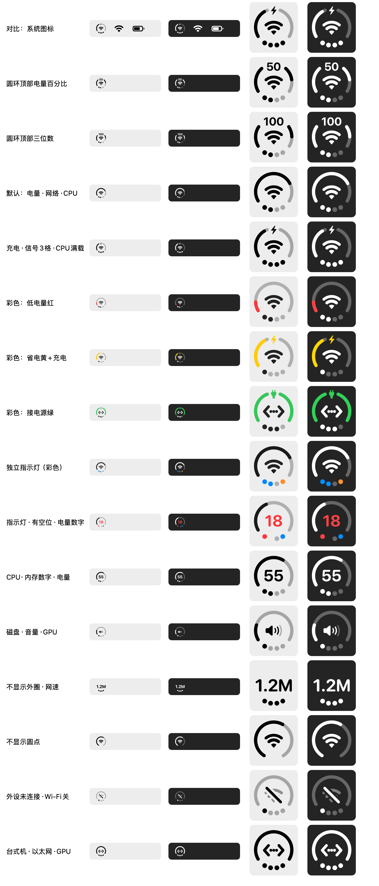
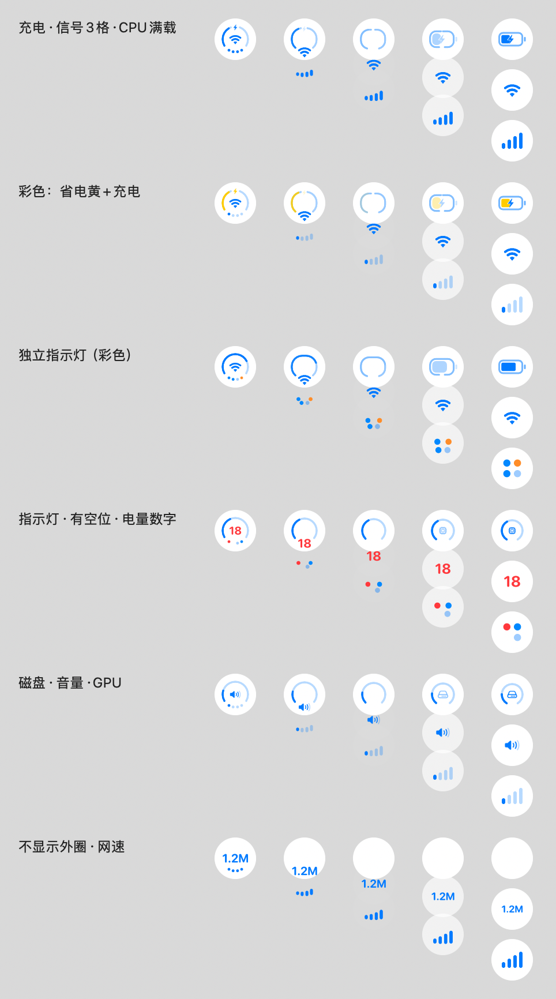
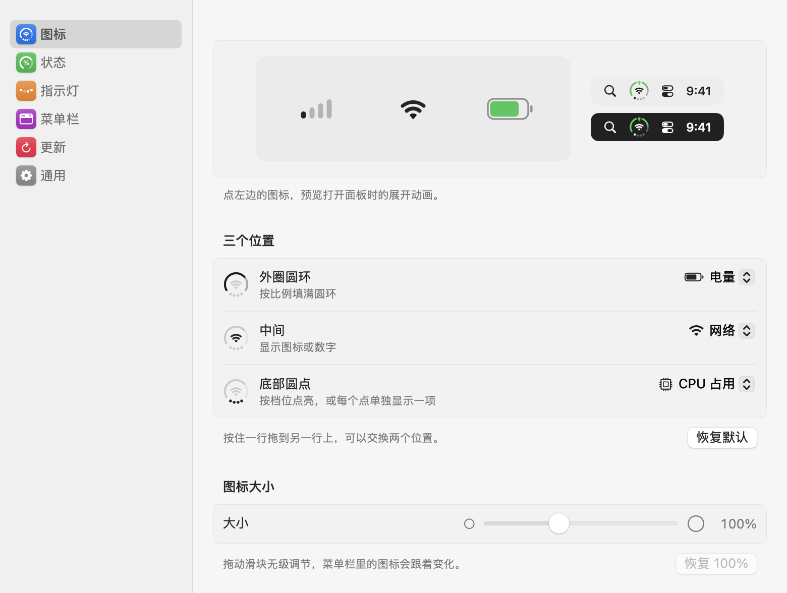

# DuoBar

把 iPhone Duo 外屏上的“三合一”状态图标搬到 Mac 菜单栏：一个圆形图标同时显示三种状态，显示什么由你决定。



> DuoBar 是独立的非官方项目，与 Apple Inc. 没有关联。

## 下载安装

从 [GitHub Releases](https://github.com/Mujh05/DuoBar/releases/latest) 下载 `DuoBar-1.4.2-arm64.dmg`。需要 macOS 14 或更高版本，仅支持 Apple Silicon（M1 及后续芯片）。

1. 打开 DMG，把 DuoBar 拖进“应用程序”。
2. 第一次启动时，在“应用程序”里右键 DuoBar，选“打开”，再确认打开。
3. 如果仍被拦截，到“系统设置 › 隐私与安全性”里找到 DuoBar 的提示，点“仍要打开”。

安装包用自签名证书签名，还没有经过 Apple 公证，所以直接双击可能被 Gatekeeper 拦截，这不代表安装包损坏。装好以后，新版本可以在 DuoBar 里一键更新，见[更新](#更新)。

## 图标

图标分三个位置，每个位置显示一种状态：

| 位置 | 怎么显示 |
| --- | --- |
| 外圈圆环 | 按比例填满圆环，从左下角顺时针增长。放电量时，充电显示闪电，接着电源但没在充电显示插头 |
| 中间 | 网络显示 Wi-Fi / 以太网 / 热点图形，音量显示喇叭，其他状态显示数字 |
| 底部圆点 | 显示某个状态的档位（≥5%、≥30%、≥55%、≥80% 依次点亮），或者切到“独立指示灯”，4 个点各自显示一项开关 |

默认是外圈电量、中间网络、底部 CPU。每个位置都可以换成下面任意一种状态，也可以不显示（至少留一个）。外圈不显示时，中间的内容会放大；底部不显示时，圆环开口会收小。

| 状态 | 说明 | 更新频率 |
| --- | --- | --- |
| 电量 | 内置电池剩余电量；台式机显示为接着电源 | 系统通知 |
| 网络 | 连接方式（Wi-Fi、以太网、个人热点）；数值是 Wi-Fi 信号强度，有线算满格 | 系统通知 + 8 秒 |
| CPU 占用 | 所有核心的平均占用率 | 2 秒 |
| GPU 占用 | 图形处理器占用率 | 2 秒 |
| 内存占用 | App 内存 + 联动内存 + 被压缩的内存，占总内存的比例 | 2 秒 |
| 磁盘空间 | 启动磁盘已用空间的比例 | 1 分钟 |
| 网速 | 所有网卡上传加下载的总速度，1 KB/s 到 100 MB/s 按数量级显示 | 2 秒 |
| 音量 | 当前输出设备音量，静音时变暗 | 1 秒 |
| 蓝牙外设电量 | 妙控键盘、鼠标、触控板里最低的电量（读不到 AirPods） | 1 分钟 |

Wi-Fi 信号：≥ −55 dBm 4 格，≥ −65 dBm 3 格，≥ −75 dBm 2 格，更弱 1 格。

### 独立指示灯

底部圆点切到“独立指示灯”后，4 个点从左到右各自显示一项，打开时亮、关闭时暗，也可以空着：

| 分类 | 指示灯 |
| --- | --- |
| 网络 | 蓝牙、Wi-Fi、已联网、VPN、个人热点、有线网络 |
| 声音 | 蓝牙耳机（声音从蓝牙设备播放）、麦克风使用中、静音 |
| 电源 | 正在充电、接着电源、低电量模式、电量低（≤ 20% 且没接电源） |
| 其他 | 外接显示器、大写锁定、内存紧张、磁盘快满（可用空间 < 10%） |

### 电量百分比

在设置的“菜单栏”页里选电量数字显示在哪里：

- 不显示
- 图标左边，电量不高于 20% 时才显示（默认）
- 图标左边，一直显示
- 圆环顶部：和 iPhone Duo 一样嵌在外圈圆环顶部的开口里，圆环按数字的宽度让出位置，数字不会和圆环连在一起

### 颜色

- **电量变色**：低电量模式黄色；电量不高于 20% 且没接电源红色；可选接着电源时绿色。电量放在哪个位置都会变色。
- **指示灯颜色**：亮起的点用各自的颜色，比如蓝牙蓝色、麦克风橙色、静音红色。

没有颜色时，菜单栏图标是系统的模板图像，深浅由系统处理；带颜色时 DuoBar 会按菜单栏的深浅自己选择黑色或白色。

## 面板

点菜单栏图标会弹出面板。它和 macOS 26 的控制中心一个样子：没有箭头和底板，胶囊、展开的详情和底部按钮各是一块系统的玻璃，直接浮在桌面上，跟着系统的玻璃样式（透明、着色）变化；深浅和控制中心一样跟着菜单栏走，壁纸深、菜单栏是白字时面板也是白字。macOS 14、15 没有液态玻璃，面板是一整块毛玻璃。打开时不会抢走前台 App 的焦点。

打开时，几个胶囊从同一个位置滑开，三合一图标跟着拆开，外圈、中间和底部圆点各自落进一个胶囊的圆形图标里：电量的圆环变成电池，其他外圈状态变成小圆环，指示灯圆点排成 2×2，档位圆点变成信号格。macOS 26 起胶囊是系统的玻璃，滑开时像一滴水分成几滴，也跟着系统的玻璃样式（透明、着色）和深浅色变化。系统开启“减弱动态效果”时直接显示拆开后的样子。



面板平时是几个控制中心样式的胶囊，分别对应图标的外圈、中间和底部圆点，写着各自现在的状态。点一个胶囊，其他的会收起，下面展开和系统菜单一样的详情，再点一次收起；点胶囊左边的圆形图标可以直接开关 Wi-Fi 或静音。点面板外面、按 Esc 或切到别的 App 时面板会收起，下次打开时回到只有胶囊的样子。

| 点的胶囊 | 展开的内容 |
| --- | --- |
| Wi-Fi | 和系统的 Wi-Fi 菜单一样：开关、已知网络、其他网络，“Wi-Fi 设置…” |
| 电池 | 和系统的电池菜单一样：电源、充电状态、“立即充满电”、能耗模式、使用大量能耗的 App，“电池设置…” |
| 声音 | 音量滑块、输出设备，“声音设置…” |
| 指示灯 | 每个指示灯的状态；Wi-Fi 和静音可以直接开关 |
| CPU、GPU、内存、网速 | 详细数值，“活动监视器…” |
| 磁盘、蓝牙外设 | 详细数值，“存储空间…” / “蓝牙设置…” |

### 电池

关掉系统自带的电池图标后，系统电池菜单里的内容在 DuoBar 里也有：

- 充电状态的说法和系统一致：暂停充电、正在充电至 80% 上限、已充电至 80% 上限、电量达到 80% 时将停止充电、完全充满电还需多久、慢充、建议维修
- 优化电池充电暂停了充电，或者设了充电上限时，可以点“立即充满电”。DuoBar 调用的是控制中心同款的系统接口（私有框架 PowerUI），不需要额外的权限。系统接受后，电池通常要过一两分钟才真正开始充电，这段时间面板显示“即将开始充电”；如果暂停的是手动设置的充电上限，系统会在下一个早上 6 点自动恢复上限，面板里会注明
- 能耗模式（自动、低电量、高电量）只能显示：macOS 只允许系统自己切换，点它会打开电池设置
- “使用大量能耗”没有公开接口，DuoBar 按最近的 CPU 占用来估，Safari 网页这类辅助进程算在所属的 App 头上；只在电池详情展开时统计

### Wi-Fi

网络放在图标上时点 Wi-Fi，没放时面板里会单独多一个 Wi-Fi，展开后和系统的 Wi-Fi 菜单一样，可以开关 Wi-Fi、查看附近的网络并切换。关掉系统自带的 Wi-Fi 图标后，日常使用也不受影响：

- 当前网络用白底蓝色的图标显示；系统里保存过的网络列在“已知网络”，其他网络收在“其他网络”里，面板开着时每 15 秒刷新一次
- 点网络直接切换。macOS 不让 App 读取或使用系统保存的 Wi-Fi 密码（不带密码调用 `associate` 会被拒绝，系统内部的加入接口也不对 App 开放），所以加密网络第一次加入时，这个网络下面会展开密码框，回车加入、Esc 取消；勾选“记住密码”后存进你的钥匙串，下次就不再问；密码不对时会提示并让你重输。记住的密码可以在设置的“通用”页里清除
- 需要账号登录的企业网络（802.1X）请在“Wi-Fi 设置…”里加入
- macOS 只把网络名称提供给有定位权限的 App；读不到名称时，面板里会出现授权按钮
- 不需要的话，可以在设置的“通用”页里关掉这一部分

## 设置

面板里的“DuoBar 设置…”会打开设置窗口。它按 macOS 系统设置的样子排版：左边 6 页，右边是分组列表，窗口标题显示当前页的名字；左边的图标用 DuoBar 自己的圆环和圆点画成。



| 页面 | 内容 |
| --- | --- |
| 图标 | 预览（左边是面板顶部的胶囊，点一下播放打开面板时的拆分动画；右边是浅色和深色菜单栏里的样子）、三个位置（按住一行拖到另一行上可以交换）、独立指示灯的 4 个圆点、图标大小（70%–150% 无级调节）、颜色 |
| 状态 | 9 种状态和它们的实时数值；右边的按钮或右键可以把它放到某个位置 |
| 指示灯 | 4 个圆点，下面按网络、声音、电源、其他列出全部指示灯；指示灯可以拖到圆点上，圆点之间也能拖动交换 |
| 菜单栏 | 电量百分比的显示位置（带预览）、⌘ 拖动调整位置的演示、打开“系统设置 › 菜单栏” |
| 更新 | 当前版本、手动检查、每天自动检查 |
| 通用 | 面板里的 Wi-Fi 控制、登录时自动启动、关于 |

“图标”页的预览和面板用的是同一套胶囊：平时是合起来的样子，点一下会像打开面板时那样拆开，停一会儿再合回去。

只有正在显示的内容才会采样；打开设置窗口时会采样全部内容，方便对照（蓝牙除外，没授权时不会因此弹出权限框）。系统开启“减弱动态效果”时，循环播放的演示动画会停下。

macOS 不允许其他 App 移除系统的 Wi-Fi 和电池图标。想只留下 DuoBar，在“菜单栏”页点“打开菜单栏设置…”，或者直接打开“系统设置 › 菜单栏”，把 Wi-Fi 和电池设成不在菜单栏显示。

## 更新

DuoBar 每天向 GitHub 查询一次新版本，只请求公开的发布信息，不发送任何个人数据；也可以在设置的“更新”页里关掉，或者手动检查。发现新版本时面板里会出现提示，点“立即更新”：

1. 把安装包下载到临时文件夹，按发布说明里的 SHA-256 校验。
2. 在后台挂载安装包（不在 Finder 和启动台里出现），核对里面的 App 是 DuoBar、版本号一致、签名完整。
3. 把新版本复制到 DuoBar 所在的磁盘上，和旧版本原地对调，然后自动重新打开。安装包和旧版本都会删掉。

DuoBar 放在不能直接替换的位置时（比如直接从“下载”文件夹或安装包里运行，或者没有权限），会改为打开安装包：请先退出 DuoBar，再把新版本拖进“应用程序”，以后就能自动更新了。

原地更新从 1.2 开始才有：1.1 和 1.1.1 更新时还要手动拖一次；1.0 没有更新提醒，需要手动下载。

## 权限

- 除了下面两项，所有状态都通过公开接口读取，不需要任何权限。
- 蓝牙：只有用到“蓝牙”指示灯时才会申请。DuoBar 只读开关状态，不扫描也不连接设备。
- Wi-Fi 网络名称：macOS 只把它提供给有定位权限的 App。只有在面板里点授权按钮时才会申请，DuoBar 不会读取你的位置。
- 从 1.4.2 开始，安装包用自签名证书“DuoBar Code Signing”签名。系统按“App 标识 + 证书”记住授权，所以更新后定位、蓝牙等权限不会丢；从更早的 ad-hoc 版本更新到 1.4.2 时还会再问一次。自签名证书不被 Apple 信任，第一次安装仍要在“隐私与安全性”里点“仍要打开”。
- 记住的 Wi-Fi 密码存在用户的钥匙串里。实测钥匙串不会把这些条目和同一台 Mac 上的其他程序隔开（ad-hoc 和自签名证书都一样），不想存可以在输入密码时取消勾选，或者在设置的“通用”页里清除。

## 从源码构建

需要 macOS 14 或更高版本和 Xcode（SwiftUI 的宏插件只随 Xcode 提供，单独的 Command Line Tools 编译不了）。当前开发工具是 Command Line Tools 时，构建脚本会自动改用 `/Applications/Xcode.app` 的工具链。

```bash
scripts/build.sh            # 生成 build/app.noindex/DuoBar.app
scripts/build.sh --install  # 装到 ~/Applications 并启动
scripts/package.sh          # 生成 build/DuoBar-<版本>-arm64.dmg 并打印 SHA-256
```

- App 生成在名字以 `.noindex` 结尾的文件夹里，Spotlight 不会收录，开发版就不会出现在启动台里。
- 钥匙串里有“DuoBar Code Signing”证书时，构建脚本用它签名，否则用 ad-hoc 签名；`DUOBAR_SIGN_IDENTITY` 可以指定别的证书，设成 `-` 就是 ad-hoc。发布的安装包要一直用同一张证书签，用户更新后才不会丢失已授予的权限。
- 安装包优先用 `diskutil image` 制作（macOS 27 上 `hdiutil` 已不推荐使用），`diskutil` 不支持时还用 `hdiutil`。
- 想开启“登录时自动启动”，建议先用 `--install` 装到固定位置。

发布新版本时，把 `Resources/Info.plist` 里的版本号改好，标签写成 `v<版本>`（比如 1.3 写成 `v1.3.0`），并在发布说明里附上一行 ``SHA-256: `<哈希>` ``，应用内更新会用它校验下载的安装包。

## 开发

```bash
swift build
.build/debug/DuoBar --render-previews build/previews   # 把各种布局和状态画成 PNG（docs/icons.png 就是这样生成的）

# 下面几个调试参数用 open 启动：直接运行可执行文件时，蓝牙、定位等权限会算到终端头上，可能被系统强制结束
open -n -W --stdout build/out.txt build/app.noindex/DuoBar.app --args --debug-snapshot "$PWD/build/snapshots"
# 截下菜单栏按钮、面板和设置窗口，然后退出（离屏渲染画不出玻璃材质）
open -n -W --stdout build/out.txt build/app.noindex/DuoBar.app --args --debug-panel ring
# 打开面板并展开一项（ring、center、dots、wifi，或者 none）停留 5 秒，打印面板位置，可以用 screencapture -R 截下真实的玻璃效果。
# DUOBAR_DEBUG_APPEARANCE=dark|light 指定深浅色，DUOBAR_DEBUG_WAIT 指定打印位置前等几秒，DUOBAR_DEBUG_SPLIT=0…1 固定拆分进度
open -n -W --stdout build/out.txt build/app.noindex/DuoBar.app --args --debug-wifi
# 只读检查 Wi-Fi 扫描和网络名称，不改变任何 Wi-Fi 状态
open -n -W --stdout build/out.txt build/app.noindex/DuoBar.app --args --debug-update "$PWD/build/updates"
# 查询最新版本，把安装包下载到指定目录并校验 SHA-256，再报告当前位置能不能原地替换
open -n -W --env DUOBAR_PRETEND_VERSION=1.0 --stdout build/out.txt <副本>/DuoBar.app --args --debug-self-update
# 和点“立即更新”一样走完整个过程：替换这个副本并重新打开它，所以要用一份副本来试。
# DUOBAR_PRETEND_VERSION 假装是旧版本；DUOBAR_UPDATE_API 可以指向本地的假发布信息（格式同 GitHub 的 releases/latest 接口）
```

用 `open` 启动过的 App 会被系统登记，可能出现在启动台里。调试完可以用 `/System/Library/Frameworks/CoreServices.framework/Frameworks/LaunchServices.framework/Support/lsregister -u <路径>` 取消登记。

| 文件 | 内容 |
| --- | --- |
| `Metrics.swift` | 状态种类、三个位置、布局，以及每次读数和图标的数据结构 |
| `Indicators.swift` | 指示灯种类、分类、颜色、蓝牙标志 |
| `MetricReadings.swift` | 把原始数值整理成读数和面板里的文字 |
| `BatteryMonitor.swift` / `NetworkMonitor.swift` / `BluetoothMonitor.swift` / `SystemSamplers.swift` | 各个数据源 |
| `AppModel.swift` | 设置、布局，以及按需采样 |
| `DuoGeometry.swift` | 图标几何：圆环、圆点、Wi-Fi 等部件，圆环顶部的电量数字，以及圆环变形成电池用的圆角矩形闭环 |
| `MarkRenderers.swift` | 同一套绘制指令分别画到 Core Graphics（菜单栏）和 SwiftUI Canvas（面板、设置） |
| `TextPath.swift` | 把数字转成轮廓路径 |
| `PanelTiles.swift` / `TileGlyph.swift` | 面板顶部的胶囊和拆分动画（设置里的预览也用它）；胶囊里三合一图标各部分的图案 |
| `WiFiControl.swift` / `WiFiPasswords.swift` / `WiFiSection.swift` | Wi-Fi 开关、扫描和加入网络，记住的密码，以及面板里对应的界面 |
| `UpdateChecker.swift` | 通过 GitHub Releases 检查、下载并校验新版本 |
| `UpdateInstaller.swift` | 挂载安装包、核对新版本，原地替换当前的 DuoBar 并重新打开 |
| `PanelView.swift` / `MenuComponents.swift` / `MenuPanel.swift` / `StatusController.swift` | 弹出面板（控制中心样式的胶囊、系统菜单样式的详情、贴着菜单栏的玻璃窗口）、菜单栏按钮 |
| `ChargingControl.swift` / `EnergyUsage.swift` | 优化充电和充电上限的状态、“立即充满电”，以及估算使用大量能耗的 App |
| `SettingsWindow.swift` / `Settings*Page*.swift` / `SettingsComponents.swift` | 设置窗口的分页、各页内容和共用部件 |
| `SettingsPageIcon.swift` | 设置侧边栏的页面图标，用 DuoBar 的圆环和圆点画成 |

图标比例是从新闻配图里的 iPhone Duo 图标量出来的，以圆环半径 R 为单位：圆环线宽 0.156R，底部开口约 119°，4 个圆点直径 0.22R、每隔 20° 排在同一圆周上，Wi-Fi 扇形张角 80°。嵌在圆环顶部的电量数字参考 iPhone Duo 打开“电量百分比”后的样子：SF Pro 粗体，字高 0.46R，圆环按数字的宽度让出开口，两端和数字之间空出约 0.2R。菜单栏里的图标只有十几个点高，所以线条会稍微加粗；图标放大后线条再逐渐回到原始比例（见 `DuoStyle.menuBar(scale:)`）。
